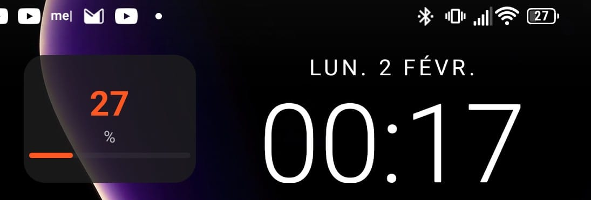
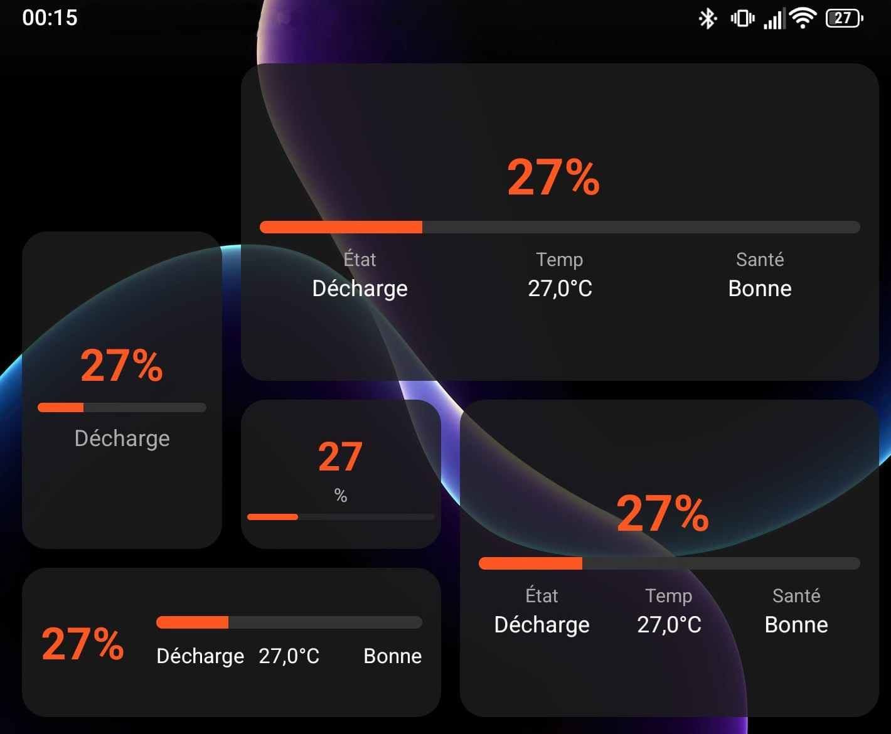
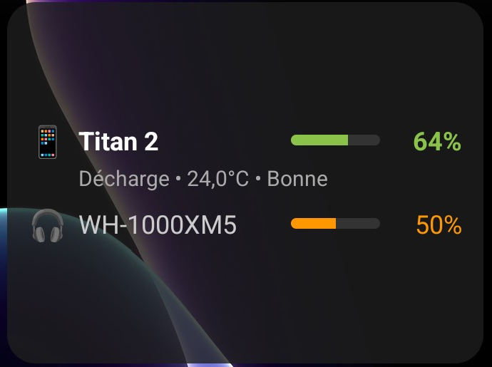

# CleanWatt

**Large Android battery widget for people with declining eyesight.**

Stop squinting at the tiny battery icon in the status bar. CleanWatt displays your battery level in large format on your home screen: percentage, charging status, temperature, and health. It also monitors connected Bluetooth devices (headphones, watches, gamepads, etc.) and shows their battery levels. Real-time updates, no ads, no tracking.

## Screenshots

| Single widget | All widget sizes | Bluetooth devices |
|:---:|:---:|:---:|
|  |  |  |

## Features

- Large, easy-to-read battery percentage
- Multiple adaptive widget sizes (small, medium, horizontal, large)
- Bluetooth device battery monitoring (headphones, watches, gamepads, keyboards, etc.)
- Charging status indicator
- Battery temperature
- Battery health
- Power saving mode indicator
- Color-coded levels: green (>50%), orange (20-50%), red (<20%)
- Real-time updates
- Multi-language support (English, French, Spanish, German)

## Build

```bash
dotnet build -c Release
```

## Contributions

If you improve this project, please submit a Pull Request so everyone can benefit.

## License

MIT License - Do whatever you want with this code.
